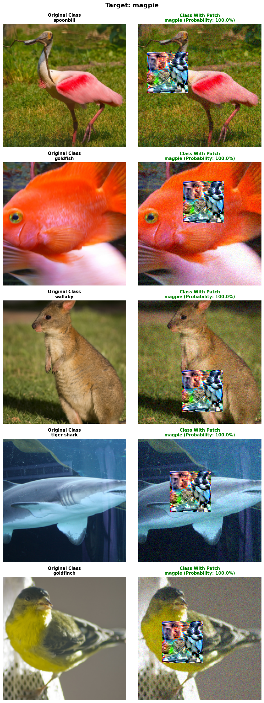

# Adversarial Patches 
## 📘 Project Overview
Artificial intelligence (AI) systems have achieved remarkable accuracy in image recognition, speech processing, and decision-making. However, they remain surprisingly vulnerable to subtle manipulations. Tiny, human-imperceptible changes can cause models to misclassify objects with high confidence.

To better understand this fragility, I built an **adversarial patch** — a small image designed to trick a model. I used a pretrained **ResNet34** model on the [ImageNet100 dataset](https://www.kaggle.com/datasets/ambityga/imagenet100) , with the purpose to train the patch to fool the model to predict the image as a **“magpie.”** no matter what the original picture showed.

The patch worked well on both digital photos and real-life scenes (e.g. book, pumpkin, microwave, etc), showing us how easily deep learning models can be deceived, and how important it is to build a resilient and trustworthy AI system.

## ⚙️ Methodology

### 1. Model & Dataset

   * Model: `ResNet34`
   * Dataset: [ImageNet100](https://www.kaggle.com/datasets/ambityga/imagenet100)

### 2. Patch Training

   * Target class: `magpie`
   * Patch size: `(75 × 75)`
   * Loss function combines adversarial loss + total variation (smoothness) regularization
   * Training performed on 5,000 sampled images

### 3. Evaluation

   * Tested on 5 unseen validation images from ImageNet100
   * Patch achieved **100% fooling success rate** in digital environment, consistently forcing “magpie” prediction, demonstrating strong attack effectiveness.

## 🧩 Results
### Digital Environment Test Results

### Real-world Test Results
To validate the patch outside of digital environments, I printed the trained adversarial patch and tested it across **real-world scenes**, including book with bird, bush and building, keyboard, microwave, pillow and chair, pool and building, and pumpkin. Even under varying lighting, background clutter, and camera angles, the model continued to misclassify the scene as the target class “magpie.” 

#### 🎃 Pumpkin

#### 🍽️ Microwave

#### ⌨️ Keyboard

#### 📖 Book with Bird

#### 🛋️ Pillow & Chair

#### 🏢 Pool & Building

#### 🌿 Bush & Building

